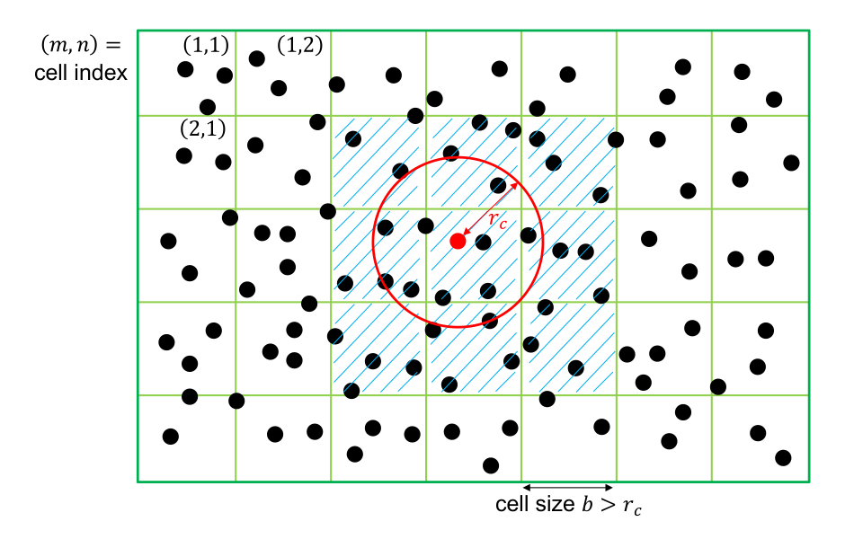

---

<h2 class='chapterHead'>Chapter 3 
Pair potentials</h2>

<!--  l. 4  -->

Context: Interatomic forces or interatomic potentials determine the material that we want to study. There is a plethora of interatomic potentials of varying accuracy, transferability and computational cost available in the literature. We here discuss simple pair potentials and point out algorithmic considerations.

<!--  l. 8  -->

Additional resources:

<ul class='itemize1'>
<li class='itemize'>Chapter 3 of <a href='https://arxiv.org/abs/2204.09563'>Interatomic potentials: Achievements and challenges</a></li>
</ul>

<h3 class='sectionHead'>3.1 Introduction</h3>
<!--  l. 16  -->

<a class='url' href='https://uni-freiburg.cloud.panopto.eu/Panopto/Pages/Embed.aspx?id=42ad47da-d1c1-48bc-9eda-ad2301538f4f'>https://uni-freiburg.cloud.panopto.eu/Panopto/Pages/Embed.aspx?id=42ad47da-d1c1-48bc-9eda-ad2301538f4f</a>

<!--  l. 18  -->

The expression for \(E_\text {pot}\left (\{ \vec {r}_{i} \} \right )\) is the model for the material that we use in our molecular dynamics calculations. It determines whether we model water, proteins, metals, or any other physical object. Models are typically characterized by their accuracy, their transferability and the computational cost involved. (Computational cost also
includes the computational complexity.) At constant computational cost, there is always a tradeoff between accuracy and transferability. Accuracy and transferability can typically only be improved at the expense of additional computational cost.

<ul class='itemize1'>
<li class='itemize'>Accuracy: Accuracy describes how close to we can get to a reference metric, experimentally measured or theoretical. For example, we can compare the vacancy formation energy to experimental values, and compute accuracy as the absolute value of the energy difference \(E_{\text {vac}} - E_{\text {vac}}^{\exp }\), which can be \(1\ \text {eV}\), \(0.1\ \text {eV}\) (typical), \(0.01\ \text {eV}\) (computationally expensive!). (The vacancy formation energy is the
energy required to remove a single atom from a solid. The resulting “hole” in the solid is called a vacancy.)</li>
<li class='itemize'>Transferability: Transferability describes the ability for a model to satisfy different accuracy metrics. Let’s assume we get the vacancy formation energy right to within \(0.1\ \text {eV}\) of the experimental value. Does the interstitial formation energy, i.e. the energy to insert an additional atom between lattice sites, give the same value? If so, then the potential is transferable between these two situations. Most interatomic
potentials are not generally transferable, and they need to be tested when used in new situations, e.g. when the potential has been used to study crystals, but you want to use it to study a glass.</li>
<li class='itemize'>Computational cost: Computational cost describes the number of floating point operations to compute an energy or a force. (Nowadays, actual electrical energy requirements for doing the calculation would be a better measure.) This is related to computational complexity, that describes how the computational cost (i.e. the number of operations required to compute the result) scales with the number of atoms. Ideally we would like \(O(N)\) complexity (i.e. a
system with twice as many particles takes twice the computing time), but many methods do not scale linearly. Quantum methods (tight-binding, density-functional theory) are usually \(O(N^{3})\) or worse.</li>
</ul>
<!--  l. 48  -->

<h3 class='sectionHead'>3.2 Pair potentials</h3>
<!--  l. 50  -->

<a class='url' href='https://uni-freiburg.cloud.panopto.eu/Panopto/Pages/Embed.aspx?id=35001264-ad07-4873-89f1-ad2301538f75'>https://uni-freiburg.cloud.panopto.eu/Panopto/Pages/Embed.aspx?id=35001264-ad07-4873-89f1-ad2301538f75</a>

<!--  l. 52  -->

We have already encountered the simplest (and oldest) form of interaction potential, the pair potential. The total energy for a system interacting in pairs can be written quite generally as \begin {equation} E_\text {pot}\left ( \{ \vec {r}_{i} \} \right ) = \frac {1}{2}\sum _{i = 1}^{N}{\sum _{j = 1}^{N}{V\left ( r_{ij} \right ) = \sum _{i &lt; j} V(r_{ij})}} \label {eq:pairpot} \end {equation} where \(r_{ij} = |\vec {r}_{i} - \vec {r}_{j}|\) is the distance
between atom i and atom j. \(V(r_{ij})\) is the pair interaction energy or just the pair potential and we assume that the interaction is pair-wise additive. The sum on the right (\(\sum _{i&lt;j}\)) runs over all pairs while sum on the left double counts each pair and therefore needs the factor \(1/2\). We have already seen a combination of the electrostatic potential and Pauli repulsion as an example of a pair-potential earlier.

<!--  l. 64  -->

Forces are computed by taking the negative gradient of this expression. The force on atom \(k\) is given by \begin {equation} \vec {f}_k = - \frac {\partial E_\text {pot}}{\partial \vec {r}_k} = - \frac {1}{2} \sum _{ij} \frac {\partial V}{\partial r_{ij}} \frac {\partial r_{ij}}{\partial \vec {r}_k} = - \frac {1}{2} \sum _{ij} \frac {\partial V}{\partial r_{ij}} \hat {r}_{ij} \left (\delta _{ik} - \delta _{jk}\right ) = \sum _i \frac {\partial V}{\partial r_{ik}} \hat {r}_{ik}, \end
{equation} where \(\hat {r}_{ik}=\vec {r}_{ik}/r_{ik}\) is the unit vector pointing from atom \(k\) to atom \(i\) and \(\delta _{ik}\) is the <a href='https://en.wikipedia.org/wiki/Kronecker_delta'>Kronecker delta</a>. Note that these forces are symmetric, i.e. the term \(\partial V/\partial r_{ik} \hat {r}_{ik}\) shows up in the expression not only for the force on atom \(k\), but also (with an opposite sign) for the force on atom \(i\). This is <a href='https://en.wikipedia.org/wiki/Newton%27s_laws_of_motion'>Newton’s third law</a>, a consequence of momentum conservation. (The sum over all forces needs to be equal to the applied external forces.) A typical implementation would therefore loop over all pairs between atoms, compute this pair term, then add it to the array entries holding the forces for both atoms.

<!--  l. 90  -->

<h4 class='subsectionHead'>3.2.1 Dispersion forces</h4>
<!--  l. 92  -->

An important contribution to interatomic and intermolecular interactions is the London dispersion force. This interaction is attractive, and acts between all atoms, even noble gases. Its origin lies in fluctuations of the atomic dipole moment. (This is a quantum mechanical effect, but the simplest model would be an electron orbiting a nucleus with a rotating dipole moment.) This fluctuating dipole induces a dipole in a second atom and these interact. The
interaction decays as \(r^{-6}\) at short distances. London dispersion forces are one of the forces that are often subsumed under the term van-der-Waals interaction.

<!--  l. 94  -->

<h4 class='subsectionHead'>3.2.2 Lennard-Jones potential</h4>
<!--  l. 96  -->

The Lennard-Jones potential combines dispersion forces with an empirical \(r^{- 12}\) model for Pauli repulsion. It is typically used for the interaction of noble atoms or molecules, i.e. systems that have closed electronic shells and therefore do not form covalent bonds. The interactions described by the Lennard-Jones potential are often called nonbonded interactions, because the typical interaction energy is on the order of \(k_B T\) (with room temperature for \(T\)). Thermal
fluctuation can thereby break this bond, hence the term nonbonded.

<!--  l. 98  -->

One typical form to writing the Lennard-Jones potential is \begin {equation} V(r) = 4\varepsilon \left [ \left (\frac {\sigma }{r}\right )^{12} - \left (\frac {\sigma }{r}\right )^6 \right ] \end {equation} where \(\varepsilon \) is an energy and \(\sigma \) a length. The potential has a minimum as \(r=2^{1/6} \sigma \) and is repulsive for shorter distances and attractive for larger distances. For a noble gas (e.g. Argon), \(\varepsilon \sim 0.01\) eV and \(\sigma \sim
3\) Å.

<!--  l. 104  -->

<h3 class='sectionHead'>3.3 Short-ranged potentials</h3>
<!--  l. 106  -->

<a class='url' href='https://uni-freiburg.cloud.panopto.eu/Panopto/Pages/Embed.aspx?id=16d8770d-f056-45c4-a6c6-ad2301538f27'>https://uni-freiburg.cloud.panopto.eu/Panopto/Pages/Embed.aspx?id=16d8770d-f056-45c4-a6c6-ad2301538f27</a>

<!--  l. 108  -->

Implementing Eq. \eqref{eq:pairpot} naively leads to a complexity of \(O\left ( N^{2} \right )\) because the sum contains \(N^2\) terms. The trick is to cut the interaction range, i.e. set energies and forces to zero for distances larger than a certain cut-off distance \(r_c\). This is possible because \(V\left ( r \right ) \rightarrow 0\) as \(r \rightarrow \infty \). Potentials for which this asymptotic decay is fast enough can be cut-off and are called short-ranged. Note that we
have already encountered a case in Chap. ?? for which this is not possible: the Coulomb interaction that has the form \(V\left ( r \right ) \propto 1/r\), which decays to 0 too slowly.

<!--  l. 114  -->

A simple way to see why this is not possible for the Coulomb interaction is to lump the charge-neutral infinite solid into charge-neutral dipoles. The effective interaction between dipoles then falls of as \(V^{\text {eff}}\left ( r \right ) \propto 1/r^{3}\). The contribution to the energy from all dipoles at distance \(r\) is \(V\left ( r \right )r^{2} \propto 1/r\). The full energy is obtained by integrating this function over \(r\), but the integral does not converge! This illustrates
the problem. The discrete sum is convergent, but only conditionally so, i.e. the outcome depends on the order of summation. We therefore can only cut interactions that decay as \(r^{-4}\) or faster.

<!--  l. 121  -->

The potential energy with a cutoff looks as follows: \begin {equation} E_\text {pot}\left ( \{ \vec {r}_{i} \} \right ) = \frac {1}{2}\sum _{i = 1}^{N}{\sum _{\{ j|r_{ij} &lt; r_{c}\}}^{}{V\left ( r_{ij} \right )}} \label {eq:pairpotcut} \end {equation} The difference to Eq. \eqref{eq:pairpot} is that the second sum runs only over neighbors of \(i\), i.e. those atoms \(j\) whose distance \(r_{ij}&lt;r_c\) where \(r_c\) is the cutoff radius. This sum has
\(N\bar {n}\) elements where \(\bar {n}\) is a constant, is the average number of neighbors within the cutoff radius \(r_{c}\). The complexity of an algorithm that implements the above sum is hence \(O(N)\).

<!--  l. 130  -->

A simple pair potential is often shifted by a constant to make the pair interaction energy continuous at \(r = r_c\) (since in general \(V\left ( r_{c} \right ) \neq 0\)). The potential energy expression is then \(E_\text {pot} = \sum _{i &lt; j}^{}\left ( V\left ( r_{ij} \right ) - V\left ( r_{c} \right ) \right )\). Note that only by shifting the potential, forces and potential energy become consistent. Since only the forces affect the dynamics, the potential energy must be continuous
and the integral of the forces, otherwise the Hamiltonian \(H\) is not a conserved quantity. The shifted potential fulfills these requirements, the unshifted one does not.

<!--  l. 134  -->

<h3 class='sectionHead'>3.4 Neighbor list search</h3>
<!--  l. 136  -->

The sum Eq. \eqref{eq:pairpotcut} runs over all neighbors. One important algorithmic step with complexity \(O(N)\) in molecular dynamics codes is to build a neighbor list, i.e. find all pairs i-j with \(r_{ij} &lt; r_{c}\). This is usually done using a domain decomposition (see Fig. <a href='#x1-7001r1'>3.1<!--  tex4ht:ref: fig:neighborsearch   --></a>) that
divides the simulation domain in cells of a certain size and sorts all atoms into one of these cells. The neighbor list can then be constructed by looking for neighbors in neighboring cells only. If the cell size \(b\) is larger than the cutoff radius, \(b&gt;r_c\), then we only need to look exactly the neighboring cells.

<figure class='figure'><!--  l. 146  -->

  

<figcaption class='caption'>Figure 3.1: Illustration of the typical data structure used for an \(O(N)\) neighbor search in a molecular dynamics simulation. For searching the neighbors within a cutoff \(r_c\) of the red atom, we only need to consider the candidate atoms that are in the cells adjacent to the red atom.</figcaption>
<!--  tex4ht:label?: x1-7001r3.4   --></figure>
<!--  l. 151  -->

We will here illustrate a typical neighbor search using the two-dimensional example shown in Fig. <a href='#x1-7001r1'>3.1<!--  tex4ht:ref: fig:neighborsearch   --></a>. Let us assume that each atom has a unique index \(i\in [1,N]\), where \(N\) is the total number of atoms. (Note: in C++ and other common languages, indices start at \(0\) and run to \(N-1\).) A neighbor search algorithm first builds individual lists \(\{B_{k,mn}\}\) that contain the indices off all atoms in cell
\((m,n)\), i.e. \(k\in N_{nm}\) where \(N_{nm}\) is the number of atoms in this cell. The cell can simply be determined by dividing the position of the atom by the cell size \(b\), i.e. atom \(i\) resides in cell \(m_i=\lfloor x_i/b \rfloor \) and \(n_i=\lfloor y_i/b \rfloor \) where \(\lfloor \cdot \rfloor \) indicates the closest smaller integer. The lists \(\{B_{k,mn}\}\) are most conveniently stored in a single contiguous array; for purposes of accessing individual cells, a second array is required
that stores the index of the first entry of the cell \((m,n)\). Note that this second array’s size is equal to the number of cells, and can become prohibitively large when the system contains a lot of vacuum.

<!--  l. 153  -->

The neighbor search then proceeds as follows: for atom \(i\), compute the cell \((m_i,n_i)\) in which this atom resides and then loop over all atoms in this cell and in cells \((m_i\pm 1,n_i)\), \((m_i, n_i\pm 1)\) and \((m_i\pm 1, n_i\pm 1)\). In two dimensions, this yields a loop over \(9\) cells, in three-dimensions there the loop runs over \(27\). If the distance between these two atoms is smaller than the cutoff \(r_c\), we add it to the neighbor list. Note that if the cell size
\(b\) is smaller than \(r_c\), we need to include more cells in the search.

<h2 class='likechapterHead'>Bibliography</h2>
