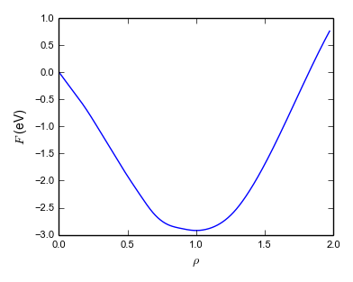
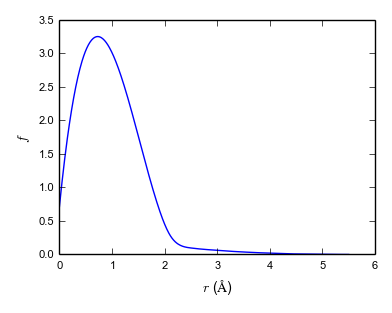
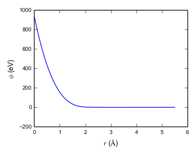

<h2 class='chapterHead'>Chapter 5 
Embedded-atom method potentials</h2>

<!--  l. 4  -->

Context: We here introduce a more complex interatomic potential that is suitable for modeling metals, the embedded atom method potential. It belongs to the class of many-body interatomic potentials and can be used to model mechanical or thermodynamic properties of metals.

<h3 class='sectionHead'>5.1 Introduction</h3>
<!--  l. 10  -->

Metals are often cubic crystals with anisotropic mechanical properties. Crystals with cubic symmetry have three independent elastic constants, \(C_{11}\), \(C_{12}\) and \(C_{44}\) that roughly describe the resistance to volume change, dilational shear and simple shear. (More on this will be discussed in Chapter ?? where we discuss properties of solids.) The original driving force behind the development of the embedded atom method (EAM) was to overcome
the zero Cauchy pressure \(P_{C} = (C_{11} - C_{44})/2\) for solids obtained for pair potentials: Pair potentials always satisfy the Cauchy relation \(C_{11}=C_{44}\), hence there are only two independent elastic constants for cubic solids. [Compare: For an isotropic solid there are also two independent elastic constants, but this condition is different, bulk modulus \(K = (C_{11} + 2C_{12})/3\) and shear modulus \(G = C_{44} = ( C_{11} - C_{12}
)/2\).] The Cauchy relation can be relaxed by adding an energy term that depends on the volume per atom \(v = V/N\) (<a href='#Xvitek_pair_1996'>Vitek</a>, <a href='#Xvitek_pair_1996'>1996</a>) \begin{equation} E( \{ \vec{r}_i \} ) = \frac{1}{2}\sum _{i = 1}^{N}{\sum _{j = 1}^{N}{V( r_{ij}) + NU(V/N)}} \label{eq:pairplusdens} \end{equation} The volume dependent term contributes only to deformation modes that do not conserve the volume, i.e. \(C_{11}\). This hence
breaks the Cauchy relationship \(C_{11} = C_{44}\) and gives a non-zero Cauchy-pressure \(P_{C} = (C_{11} - C_{44})/2\)

<!--  l. 29  -->

While a potential of the type given by Eq. \eqref{eq:pairplusdens} can be adjusted to give the correct elastic constant (and can therefore be accurate), it cannot be used for e.g. free surfaces (and is therefore not transferable). This has historically driven the development of more advanced methods for modeling solids such as the EAM described here. Note that EAM potentials are not confined to the realm of solids but can also be used for studying
properties of melt, or the transition between solid and melt.

<!--  l. 36  -->

<h3 class='sectionHead'>5.2 Functional form</h3>
<!--  l. 38  -->

The EAM is based on the assumption that the energy of an impurity in a host crystal lattice is a functional of the overall electron density \(\rho (\vec{r})\) (that leads to an attraction), plus some form of repulsion (i.e. due to Pauli exclusion). This can be written as \(E_\text{pot}=\mathcal{F}\left \lbrack \rho ( \vec{r} ) \right \rbrack + V_{\text{rep}}\), where \(\mathcal{F}\) is called the embedding functional that tells us the relationship between energy and electron density and
\(V_{\text{rep}}\) some repulsive interaction.

<!--  l. 42  -->

We view each individual atom in the system as an impurity in the host consisting of all other atoms (<a href='#Xdaw_semiempirical_1983'>Daw and Baskes</a>, <a href='#Xdaw_semiempirical_1983'>1983</a>). \(\mathcal{F}\) is then approximated by a function that depends on the local electron density \(\rho _{i}\) at atom \(i\): \begin{equation} E_\text{pot}( \{{\vec{r}}_{i} \} ) = \sum _{i}{\mathcal{F}( \rho _{i} )} +
\frac{1}{2}\sum _{i,j}^{}{V( r_{ij} )} \end{equation} Note the first sum is over atoms, not pairs, and the second term is a simple pair interaction. The missing ingredient is now the local electron density \(\rho _i\), which we approximate from the local density of the nuclei. This assumes that each atom in the vicinity of atom \(i\) contributes a certain number of electrons to the position of atom \(i\).

<!--  l. 52  -->

The embedding function \(\mathcal{F(}\rho )\) is negative and (typically) decreases monotonously with increasing density. The more closely a structure is packed the lower the energy. The repulsive term that is physically due to electrostatic and Pauli repulsion then stabilizes the structure. This is balance between attractive and repulsive contribution a common feature of most interatomic potentials, and we have already seen it for the Lennard-Jones potential.

<!--  l. 59  -->

The local density of the atomic system is easily computed from \begin{equation} \rho _{i} = \sum _{j}{f(r_{ij})} \end{equation} If \(f(r)\) is a step function that drops to zero at a distance \(r_{c}\) then \(\rho _{i}\) becomes the coordination number, i.e. the number of atoms within a sphere of radius \(r_{c}\). By normalizing the step function with the volume of the sphere, it becomes clear that \(\rho _{i}\) is some measure of the average atomic density within a distance \(r_{c}\)
from atom i. However, a step function is not differentiable. All distance dependent functions are therefore smoothly connected to zero at a distance \(r_{c}\) (the cutoff). This makes the whole functional form differentiable at least once!

<!--  l. 73  -->

Examples of early EAMs are <a href='#Xgupta_lattice_1981'>Gupta</a> (<a href='#Xgupta_lattice_1981'>1981</a>), <a href='#Xfinnis_simple_1984'>Finnis and Sinclair</a> (<a href='#Xfinnis_simple_1984'>1984</a>) and <a href='#Xcleri_tight-binding_1993'>Cleri and Rosato</a> (<a href='#Xcleri_tight-binding_1993'>1993</a>). They all employ the specific functional forms \begin{align} \mathcal{F}\left ( \rho \right ) &amp;= - A\sqrt{\rho } \\ f\left ( r_{ij} \right ) &amp;= e^{-
2q(r_{ij} - r_{0})} \\ V\left ( r_{ij} \right ) &amp;= Be^{- p(r_{ij} - r_{0})} \end{align}

<!--  l. 79  -->

where \(A\), \(B\), \(q\), \(p\) and \(R_{0}\) are parameters. For example, <a href='#Xcleri_tight-binding_1993'>Cleri and Rosato</a> (<a href='#Xcleri_tight-binding_1993'>1993</a>) give parameters for the elements Ni, Cu, Rh, Pd, Ag, Ir, Pt, Au, Al, Pb, Ti, Zr, Co, Cd, Zn and Mg. Note that the cutoff radius \(r_c\) in most potentials based on the embedded-atom approach reaches out to second nearest neighbors or further, e.g. to fifth nearest neighbor for fcc metals in the <a href='#Xcleri_tight-binding_1993'>Cleri and Rosato</a> (<a href='#Xcleri_tight-binding_1993'>1993</a>) potential. These potentials do not describe fundamental forces of nature but they must be parametrized for a specific material. The parametrization also includes choice of cutoff radius \(r_c\).

<!--  l. 83  -->

<h3 class='sectionHead'>5.3 Parameterization</h3>
<!--  l. 85  -->

There exist different strategies to actually determine the parameters of a potential. <a href='#Xcleri_tight-binding_1993'>Cleri and Rosato</a> (<a href='#Xcleri_tight-binding_1993'>1993</a>), as an example, have five parameters and they fit the potential directly to experimental values of the cohesive energy, lattice constant and the three cubic elastic constants.

<!--  l. 91  -->

Some authors adjust the either embedding function or repulsive pair potential to reproduce the universal equation of state (see <a href='#Xferrante_diatomic_1983'>Ferrante et al.</a> (<a href='#Xferrante_diatomic_1983'>1983</a>); <a href='#Xrose_universal_1984'>Rose et al.</a> (<a href='#Xrose_universal_1984'>1984</a>) and Chapter ??). For example, <a href='#Xfoiles_embedded-atom-method_1986'>Foiles
et al.</a> (<a href='#Xfoiles_embedded-atom-method_1986'>1986</a>) obtain \(f(r_{ij})\) from the electron density of free atom calculations, and assume the pair repulsion is entirely electrostatic, \(V\left ( r_{ij} \right ) = Z_{i}\left ( r_{ij} \right )Z_{j}(r_{ij})/r_{ij}\) (with atomic charges \(Z_{i}\) actually depending on the distance between atoms, \(Z\left ( r_{ij} \right ) = Z_{0}\left ( 1 + \beta R^{\nu } \right )\exp{( - \alpha r_{ij})}\) where \(Z_{0}\), \(\beta \), \(\nu \) and
\(\alpha \) are parameters). The embedding function \(F(\rho )\) is then adjusted to reproduce the universal equation of state. Note that <a href='#Xfoiles_embedded-atom-method_1986'>Foiles et al.</a> (<a href='#Xfoiles_embedded-atom-method_1986'>1986</a>) have more parameters in their model than <a href='#Xcleri_tight-binding_1993'>Cleri and Rosato</a> (<a href='#Xcleri_tight-binding_1993'>1993</a>)!

<!--  l. 104  -->

A more modern approach is force matching due to <a href='#Xercolessi_interatomic_1994'>Ercolessi and Adams</a> (<a href='#Xercolessi_interatomic_1994'>1994</a>). Force matching potentials are fit to a set of calculations carried out with a more accurate and more transferable but also more expensive method (e.g. a quantum chemical method) at finite temperature. This generates a molecular dynamics trajectory that has configurations with nonzero forces on
each atom. (Fitting to equilibrium properties such as Cleri-Rosato means fitting to structures where all forces are zero.) The potential parameters are then fit to reproduce these forces. This method has the advantage that, in principle, an unlimited set of fitting target can be generated easily and the potential can be fit to a large number of parameters. An example of a force-matched EAM is <a href='#Xgrochola_fitting_2005'>Grochola et al.</a> (<a href='#Xgrochola_fitting_2005'>2005</a>). It
has no fixed functional form, but splines are used to represent the three functions \(\mathcal{F}(\rho )\), \(f(r)\) and \(V(r_ij)\). Figure <a href='#x1-4001r1'>5.1<!--  tex4ht:ref: fig:grochola   --></a> shows these functions for the <a href='#Xgrochola_fitting_2005'>Grochola et al.</a> (<a href='#Xgrochola_fitting_2005'>2005</a>) potential.

<!--  l. 115  -->

Note: While early EAM potentials had a purely attractive embedding contribution \(\mathcal{F}(\rho )\) and a purely repulsive pair contribution \(\phi (r)\), this condition is relaxed in more complex potential. As can be seen from Fig. <a href='#x1-4001r1'>5.1<!--  tex4ht:ref: fig:grochola   --></a>, <a href='#Xgrochola_fitting_2005'>Grochola et al.</a> (<a href='#Xgrochola_fitting_2005'>2005</a>)’s potential
includes a repulsive contribution from the embedding term.

<figure class='figure'><!--  l. 120  -->

    

<figcaption class='caption'>Figure 5.1:: \(\mathcal{F}(\rho )\), \(f(r)\) and \(V(r_ij)\) as employed in the Au potential by <a href='#Xgrochola_fitting_2005'>Grochola et al.</a> (<a href='#Xgrochola_fitting_2005'>2005</a>).</figcaption>
<!--  tex4ht:label?: x1-4001r5.3   --></figure>

<!--  l. 127  -->

Note: Note that these two approaches, fitting to experimental ground-state data and force-matching, are quite different from a philosophical point of view. It has been argued by <a href='#Xsukhomlinov_constraints_2016'>Sukhomlinov and Müser</a> (<a href='#Xsukhomlinov_constraints_2016'>2016</a>), that the potential should contains as few parameters as possible (Occam’s razor!) to achieve best transferability. Potential
with many parameters are often accurate for the fitting data set but not accurate outside and hence not transferable. This problem is typically referred to as overfitting.

<h3 class='sectionHead'>5.4 Forces</h3>
<!--  l. 133  -->

From the total energy expression we can straightforwardly derive forces, \(\vec{f}_{k} = - \partial E/\partial{\vec{r}_{k}}\), leading to \begin{align}{\vec{f}}_{k} &amp;= - \sum _{i}^{}{\frac{\partial \mathcal{F}\left ( \rho _{i} \right )}{\partial \rho _{i}}\frac{\partial \rho _{i}}{\partial{\vec{r}}_{k}}} - \frac{1}{2}\sum _{i,j}^{}{\frac{\partial V}{\partial r_{ij}}\frac{\partial r_{ij}}{\partial{\vec{r}}_{ij}}} \\ &amp;= - \sum _{i}^{}{\frac{\partial \mathcal{F}\left ( \rho _{i}
\right )}{\partial \rho _{i}}\sum _{j}^{}{\frac{\partial f}{\partial r_{ij}}\frac{\partial r_{ij}}{\partial{\vec{r}}_{k}}}} - \frac{1}{2}\sum _{i,j}^{}{\frac{\partial V}{\partial r_{ij}}\frac{\partial r_{ij}}{\partial{\vec{r}}_{k}}} \end{align}

<!--  l. 141  -->

Note that \(\partial r_{ij}/\partial{\vec{r}}_{k} = \left ( \delta _{\text{ik}} - \delta _{\text{jk}} \right ){\hat{r}}_{ij}\). Hence \begin{align}{\vec{f}}_{k} &amp;= - \sum _{i}^{}{\frac{\partial \mathcal{F}\left ( \rho _{i} \right )}{\partial \rho _{i}}\sum _{j}^{}{\frac{\partial f}{\partial r_{ij}}\left ( \delta _{\text{ik}} - \delta _{\text{jk}} \right ){\hat{r}}_{ij}}} - \frac{1}{2}\sum _{i,j}^{}{\frac{\partial V}{\partial r_{ij}}\left ( \delta _{\text{ik}} - \delta _{\text{jk}}
\right ){\hat{r}}_{ij}} \\ &amp;= - \sum _{i}^{}\left ( \frac{\partial \mathcal{F}\left ( \rho _{k} \right )}{\partial \rho _{k}}\frac{\partial f}{\partial r_{\text{ki}}}{\hat{r}}_{\text{ki}} - \frac{\partial \mathcal{F}\left ( \rho _{i} \right )}{\partial \rho _{i}}\frac{\partial f}{\partial r_{\text{ik}}}{\hat{r}}_{\text{ik}} \right ) - \frac{1}{2}\sum _{i}^{}\left ( \frac{\partial V}{\partial r_{\text{ki}}}{\hat{r}}_{\text{ki}} - \frac{\partial V}{\partial r_{\text{ik}}}{\hat{r}}_{\text{ik}} \right )
\end{align}

<!--  l. 148  -->

Using \({\hat{r}}_{\text{ik}} = -{\hat{r}}_{\text{ki}}\) gives \begin{equation}{\vec{f}}_{k} = \sum _{i}^{}{\left ( \frac{\partial \mathcal{F}\left ( \rho _{k} \right )}{\partial \rho _{k}} + \frac{\partial \mathcal{F}\left ( \rho _{i} \right )}{\partial \rho _{i}} \right )\frac{\partial f}{\partial r_{\text{ik}}}{\hat{r}}_{\text{ik}}} + \sum _{i}^{}{\frac{\partial V}{\partial r_{\text{ik}}}{\hat{r}}_{\text{ik}}} \end{equation} Energies and forces are typically implemented analytically in
a molecular dynamics code. Derivation (and correct implementation) of the force can be tedious for complicated potential expressions!

<h2 class='likechapterHead'>Bibliography</h2>

   F. Cleri and V. Rosato. Tight-binding potentials for transition metals and alloys. Phys. Rev. B, 48(1):22–33, 1993. URL <a href='https://doi.org/10.1103/PhysRevB.48.22' class='url'>https://doi.org/10.1103/PhysRevB.48.22</a>.

   M. S. Daw and M. I. Baskes. Semiempirical, quantum mechanical calculation of hydrogen embrittlement in metals. Phys. Rev. Lett., 50(17):1285–1288, 1983. URL <a href='https://doi.org/10.1103/PhysRevLett.50.1285' class='url'>https://doi.org/10.1103/PhysRevLett.50.1285</a>.

   F. Ercolessi and J. B. Adams. Interatomic Potentials from First-Principles Calculations: The Force-Matching Method. EPL, 26(8): 583–588, 1994. URL <a href='https://doi.org/10.1209/0295-5075/26/8/005' class='url'>https://doi.org/10.1209/0295-5075/26/8/005</a>.

   J. Ferrante, J. Smith, and J. Rose. Diatomic Molecules and Metallic Adhesion, Cohesion, and Chemisorption: A Single Binding-Energy Relation. Phys. Rev. Lett., 50(18):1385–1386, 1983. doi: 10.1103/PhysRevLett.50.1385. URL <a href='http://www.ncbi.nlm.nih.gov/pubmed/23357448' class='url'>http://www.ncbi.nlm.nih.gov/pubmed/23357448</a>.

   M. W. Finnis and J. E. Sinclair. A simple empirical N-body potential for transition metals. Phil. Mag. A, 50(1):45–55, 1984. URL <a href='https://doi.org/10.1080/01418618408244210' class='url'>https://doi.org/10.1080/01418618408244210</a>.

   S. M. Foiles, M. I. Baskes, and M. S. Daw. Embedded-atom-method functions for the fcc metals Cu, Ag, Au, Ni, Pd, Pt, and their alloys. Phys. Rev. B, 33(12):7983–7991, 1986. URL <a href='https://doi.org/10.1103/PhysRevB.33.7983' class='url'>https://doi.org/10.1103/PhysRevB.33.7983</a>.

   G. Grochola, S. P. Russo, and I. K. Snook. On fitting a gold embedded atom method potential using the force matching method. J. Chem. Phys., 123(20):204719, 2005. URL <a href='https://doi.org/10.1063/1.2124667' class='url'>https://doi.org/10.1063/1.2124667</a>.

   R. P. Gupta. Lattice relaxation at a metal surface. Phys. Rev. B, 23(12): 6265–6270, 1981. URL <a href='https://doi.org/10.1103/PhysRevB.23.6265' class='url'>https://doi.org/10.1103/PhysRevB.23.6265</a>.

   J. Rose, J. Smith, F. Guinea, and J. Ferrante. Universal features of the equation of state of metals. Phys. Rev. B, 29(6):2963–2969, 1984. URL <a href='https://doi.org/10.1103/PhysRevB.29.2963' class='url'>https://doi.org/10.1103/PhysRevB.29.2963</a>.

   S. V. Sukhomlinov and M. H. Müser. Constraints on phase stability, defect energies, and elastic constants of metals described by EAM-type potentials. J. Phys.: Condens. Matter, 28(39):395701, 2016. URL <a href='https://doi.org/10.1088/0953-8984/28/39/395701' class='url'>https://doi.org/10.1088/0953-8984/28/39/395701</a>.

   V. Vitek. Pair potentials in atomistic computer simulations. MRS Bull., 21(2):20–23, 1996. URL <a href='https://doi.org/10.1557/S088376940004625X' class='url'>https://doi.org/10.1557/S088376940004625X</a>.

