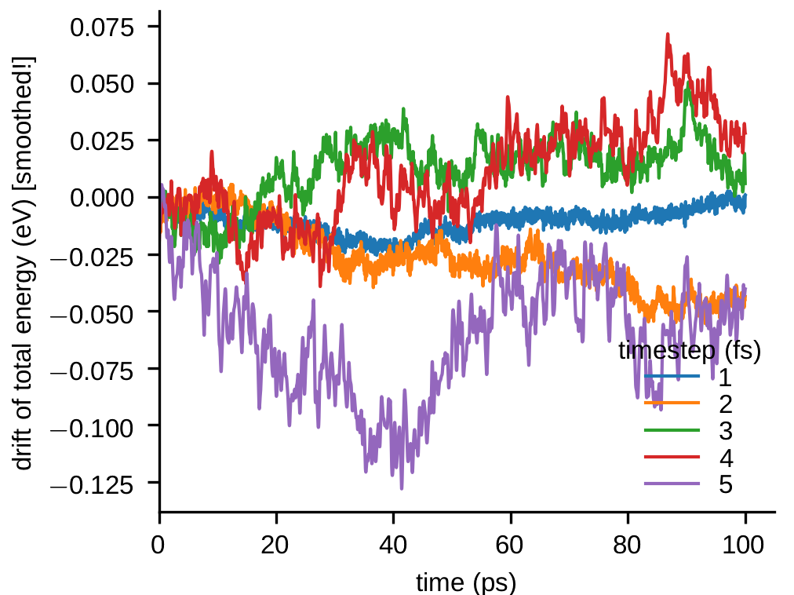

<h2 class='chapterHead'>Chapter 2 
Molecular dynamics</h2>

<!--  l. 3  -->

Context: Molecular dynamics follows the motion of individual atoms through a solution of Newton’s equations of motion. We need integration algorithms to be able to solve this set of coupled differential equations on a computer.

<h3 class='sectionHead'>2.1 Newton’s equations of motion</h3>
<!--  l. 14  -->

We have now (almost) all the ingredients to carry out a molecular dynamics simulation. From our potential energy expression \(E_{\text{pot}}(\{\vec{r}_i\})\) discussed in the previous chapter, we obtain the force \begin{equation} \vec{f}_i = -\partial E_{\text{pot}}/\partial \vec{r}_i \end{equation} on each of the \(N\) atoms. Once we know the forces, we can obtain the accelerations \(\vec{a}_i\) through Newton’s third law, \begin{equation} \vec{f}_i = m_i \vec{a}_i. \end{equation} We
are therefore assuming that atom \(i\) can be described as a point of mass \(m_i\)! The mass can be obtained from the periodic table of elements. Note that the mass listed in the periodic table is usually the average over all isotopes weighted by their occurrence on earth, and this mass is used for most practical purposes. For some application, in particular to understand the different behavior of Hydrogen and Deuterium, it can be necessary to actually model the individual isotopes by using their
respective mass.

<!--  l. 24  -->

We further have \(\vec{a}_i = \dot{\vec{v}}_i\), where \(\vec{v}_i\) is the velocity of atom \(i\), and \(\vec{v}_i = \dot{\vec{r}}_i\). The dot superscript indicates derivative with respect to time. The set of linear differential equations to solve is therefore \begin{equation} \dot{v}_i(t) = \vec{f}_i(t)/m_i\:{\text{ and} }\ \dot{\vec{r}}_i(t) = \vec{v}_i(t) \label{eq:Newton} \end{equation} with the initial (boundary) conditions \(\vec{r}_i(0) = \vec{r}_0\) and \(\vec{v}_i(0) =
\vec{v}_0\). Note that the boundary condition is an integral part of the differential Eq. \eqref{eq:Newton}. The state of the system is therefore fully and uniquely determined by the positions \(\vec{r}_i\) and the velocities \(\vec{v}_i\) of all atoms. This set of positions \(\vec{r}_i\) and momenta \(\vec{p}_i = \vec{v}_i/m_i\) defines a point in phase-space \(\vec{\Gamma } = \{ \vec{r}_i, \vec{p}_i\}\). The evolution of position and velocities given by
Eq. \eqref{eq:Newton} can therefore be thought of as a single point moving in the \(6N\) dimensional phase-space. The concept of a phase-space will become important in the next chapter when we talk about statistical mechanics.

<!--  l. 31  -->

Code example: For a molecular dynamics code, it is useful to have a data structure that represents the state of the simulation and stores at least positions and velocities. This data structure could also store element names (or atomic numbers), masses and forces. An example that uses <a href='https://eigen.tuxfamily.org/'>Eigen</a> arrays as the basic array container is shown below.

<!--  l. 33  -->


{{ my_include | markdownify }}

<!--

1using Positions_t = Eigen::Array3Xd;  
2using Velocities_t = Eigen::Array3Xd;  
3using Forces_t = Eigen::Array3Xd;  
4  
5class Atoms {  
6public:  
7    Positions_t positions;  
8    Velocities_t velocities;  
9    Forces_t forces;  
10  
11    Atoms(Positions_t &amp;p) :  
12            positions{p}, velocities{3, p.cols()}, forces{3, p.cols()} {  
13        velocities.setZero();  
14        forces.setZero();  
15    }  
16  
17    size_t nb_atoms() {  
18        return positions.cols();  
19    }  
20};

--> 
<!--  l. 55  -->

As a general rule, the data structure should be designed in a way that data that is processed consecutively is also stored in memory in a continuous manner. This ensures <a href='https://en.wikipedia.org/wiki/Cache_coherence'>cache coherenece</a>. For example, we could be tempted to create a class Atom that contains the positions, velocities, etc. of a single atom and than use an array (e.g.
std::vector&lt;Atom&gt; atoms) of that class as the basic data structure. However, positions are then no longer consecutive in memory. A function (e.g. computing forces) does not need the velocities would still load them into the cache, as the <a href='https://en.wikipedia.org/wiki/CPU_cache'>cache line size</a> for all modern CPUs is \(64\) bytes. For high-performance numerical code, it is therefore always preferable to use structures of arrays rather than arrays of structure.

<!--  l. 58  -->

<h3 class='sectionHead'>2.2 Kinetic energy and energy conservation</h3>
<!--  l. 60  -->

In addition to the potential energy \(E_{\text{pot}}(\{ \vec{r}_i\})\), the dynamical state of a system is characterized by its kinetic energy, \begin{equation} E_{\text{kin}}(\{ \vec{p}_i\}) = \sum _i \frac{1}{2} \frac{p_i^2}{m_i}. \end{equation} Note that the total energy \begin{equation} H(\{ \vec{r}_i\},\{ \vec{p}_i\}) = E_{\text{kin}}(\{ \vec{p}_i\}) + E_{\text{pot}}(\{ \vec{r}_i\}) \label{eq:hamil} \end{equation} is a conserved quantity during the motion of the atoms. This can be
seen by showing that the derivative of the total energy with respect to time vanishes, \begin{equation} \dot{H} = \dot{E}_{\text{kin}} + \dot{E}_{\text{pot}} = \sum _i \frac{\vec{p}_i \dot{\vec{p}}_i}{m_i} + \sum _i \frac{\partial E_{\text{pot}}}{\partial \vec{r}_i} \dot{\vec{r_i}} = \sum _i \vec{v}_i \vec{f}_i - \sum _i \vec{v}_i \vec{f}_i = 0. \end{equation} \(H\) is also called the Hamiltonian of the system.

<!--  l. 76  -->

Note: Measuring the total energy (or any other conserved quantity!) and checking whether it is constant in a molecular dynamics simulation is a way of testing if the time step \(\Delta t\) used in the numerical integration is small enough. We will discuss numerical integration in detail below.

<!--  l. 80  -->

A generalization of Newton’s equations of motion are Hamilton’s equation of motion, \begin{align} \dot{\vec{r}}_i &amp;= \frac{\partial H}{\partial \vec{p}_i} \\ \dot{\vec{p}}_i &amp;= -\frac{\partial H}{\partial \vec{r}_i}, \end{align}

<!--  l. 85  -->

and it is straightforward to show that this reduces to Newton’s equations of motions for the Hamiltonian given by Eq. \eqref{eq:hamil}. Hamilton’s equation of motion remain valid when positions \(\vec{r}_i\) and momenta \(\vec{p}_i\) are replaced by generalized coordinates that consider constraints, such as for example the angle of a (rigid) pendulum. These equations will become important when we discuss statistical mechanics and temperature control in molecular dynamics simulations
using thermostats, where a generalized degree of freedom is the internal state of the heat bath that controls the temperature. A full derivation of Hamilton’s equations of motion is given in Chap. ??.

<!--  l. 87  -->

Note: The temperature is simply a measure of the kinetic energy of the system, \(\frac{3}{2} N k_B T = E_{\text{kin}}\) where \(N\) is the number of atoms. In other words, \(E_{\text{kin}}\) measures the variance of the velocity distribution, which is Gaussian. We will learn more about this when discussing the basics of statistical mechanics.

<!--  l. 91  -->

<h3 class='sectionHead'>2.3 Integration algorithms</h3>
<!--  l. 94  -->

The main ingredient in any molecular dynamics simulation, regardless of the underlying model, is the numerical solution of Eqs. \eqref{eq:Newton}. A plethora of algorithms have been developed over the years, but for most practical purposes the Velocity-Verlet algorithm is used nowadays. For instructive purposes we will start out with a simple integration method, the Euler integration, before discussing Velocity-Verlet.

<!--  l. 96  -->

<h4 class='subsectionHead'>2.3.1 Euler integration</h4>
<!--  l. 97  -->

In order to follow the trajectories of all atoms we need to integrate the above differential equation. On a computer, a continuous differential equation needs to be replaced by a discrete equation. Equations \eqref{eq:Newton} are continuous in time and hence need to be discretized. (Note that our system is already discrete spatially since we are dealing with mass points, but each of these points corresponds to a physical object so this is not the result of a discretization
procedure.) The simplest integration is the Euler algorithm in which forces and velocities are assumed to be constant over time intervals \(\Delta t\).

<!--  l. 100  -->

To see this, we write the above differential equation as \begin{equation} d \vec{v}_i = \frac{\vec{f}_i(t)}{m_i}\:{\text{ and} }\ d\vec{r}_i(t) = \vec{v}_i(t)\,dt \end{equation} i.e., we move the differential \(d t\) of \(\dot{\vec{v}}_i = d\vec{v}/d t\) to the right hand side of the equation. We can now straightforwardly integrate the equation from time \(t\) to time \(t + \Delta t\) while assuming that \(\vec{f}_i\) and \(\vec{v}_i\) remain constant. This yields \begin{align}
\vec{v}_i(t+\Delta t) - \vec{v}_i(t) &amp;= \frac{\vec{f}_i(t)}{m_i} \Delta t \label{eq:eulerexplicita} \\ \vec{r}_i(t+\Delta t) - \vec{r}_i(t) &amp;= \vec{v}_i(t) \Delta t \label{eq:eulerexplicitb} \end{align}

<!--  l. 109  -->

which is obviously only a good approximation for small \(\Delta t\)! This algorithm is called Euler integration.

<!--  l. 111  -->

Same equation can be derived by Taylor-expanding \(\vec{r}_i(t+\Delta t)\) up to first order in \(\Delta t\). The algorithm is hence \(O(\Delta t^2)\). The Euler algorithm is not reversible, i.e. starting from time \(t+\Delta t\) and integrating backwards one ends up with a different result at time \(t\). Applying the Euler algorithm with timestep \(-\Delta t\) gives \begin{align} \vec{v}_i(t) - \vec{v}_i(t+\Delta t) &amp;= -\frac{\vec{f}_i(t+\Delta t)}{m_i} \Delta t \\ \vec{r}_i(t)
- \vec{r}_i(t+\Delta t) &amp;= -\vec{v}_i(t+\Delta t) \Delta t \end{align}

<!--  l. 119  -->

These equations cannot be re-arranged to give Eqs. \eqref{eq:eulerexplicita} and \eqref{eq:eulerexplicitb}. Euler integration is generally not a good algorithm and requires very small time steps.

<!--  l. 124  -->

<h4 class='subsectionHead'>2.3.2 Leap-frog integration</h4>
<!--  l. 125  -->

Leap-frog stores position at times \(t_i\) and velocities at times \(t_i+\Delta t/2\) and can be derived from a argument similar to the one given above. Specifically, we combine the results of a Taylor expansion \(\pm \Delta t/2\), yielding \begin{align} \vec{v}_i(t+\Delta t/2) - \vec{v}_i(t-\Delta t/2) &amp;= \frac{\vec{f}_i(t)}{m_i} \Delta t \label{eq:leapfrog1} \\ \vec{r}_i(t+\Delta t) - \vec{r}_i(t) &amp;= \vec{v}_i(t+\Delta t/2) \Delta t. \end{align}

<!--  l. 132  -->

Note that Eq. \eqref{eq:leapfrog1} is similar to Eq. \eqref{eq:eulerexplicita}, except the force is evaluated at the mid-point. The resulting algorithm is reversible. Applying the Leap-frog algorithm with timestep \(-\Delta t\) gives \begin{align} \vec{v}_i(t-\Delta t/2) - \vec{v}_i(t+\Delta t/2) &amp;= -\frac{\vec{f}_i(t)}{m_i} \Delta t \\ \vec{r}_i(t) - \vec{r}_i(t+\Delta t) &amp;= -\vec{v}_i(t+\Delta t/2) \Delta t \end{align}

<!--  l. 138  -->

Bring the terms on the left hand side to the right and vice-versa, and you arrive at the original equations for forward integration. Leap-frog is therefore reversible.

<!--  l. 140  -->

<h4 class='subsectionHead'>2.3.3 Verlet integration</h4>
<!--  l. 142  -->

Let us now Taylor expand \(\vec{r}_i(t\pm \Delta t)\) up to third order in \(\pm \Delta t\), \begin{equation} \label{eqn: taylor_tplus} \vec{r}_i(t\pm \Delta t) = \vec{r}_i(t) \pm \vec{v}_i(t) \Delta t + \frac{1}{2m_i} \vec{f}_i(t) \Delta t^2 \pm \frac{1}{6} \dot{\dot{\dot{\vec{r}}}}_i(t) \Delta t^3 + O(\Delta t^4). \end{equation} Note that only the odd exponents see the sign of \(\pm \Delta t\). The sum of this equation for expansion in \(+\Delta t\) and \(-\Delta t\) gives the
positions update, \begin{equation} \label{eqn: verlet} \vec{r}_i(t+\Delta t) + \vec{r}_i(t-\Delta t) = 2\vec{r}_i(t) + \frac{1}{m_i} \vec{f}_i(t) \Delta t^2 + O(\Delta t^4). \end{equation} Eq. \eqref{eqn: verlet} is called the Verlet algorithm. Instead of requiring the positions \(\{ \vec{r}_i(t)\}\) and velocities \(\{ \vec{v}_i(t)\}\) it requires the positions of the current \(\{ \vec{r}_i(t)\}\) and past \(\{ \vec{r}_i(t-\Delta t)\}\) times for the integration.

<!--  l. 155  -->

The difference between the expansion for \(+\Delta t\) and \(-\Delta t\) yields the velocities, \begin{equation} \vec{r}_i(t+\Delta t) - \vec{r}_i(t-\Delta t) = 2\vec{v}_i(t) \Delta t + O(\Delta t^3). \end{equation} Note that in order to compute the velocities at time t in the regular Verlet algorithm, we need to know the positions at time \(t + \Delta t\). Verlet and Leap-Frog are identical algorithms, since Leap-Frog stores the velocities at the intermediate time \(t+\Delta t/2\). It is
usually useful to be able to know both, positions and velocities, at time \(t\). This problem is solved by the Velocity-Verlet algorithm, described in the following section.

<!--  l. 162  -->

<h4 class='subsectionHead'>2.3.4 Velocity-Verlet integration</h4>
<!--  l. 164  -->

Let us now also Taylor expand \(\vec{r}_i(t)\) up to third order in \(\Delta t\) at \(\vec{r}_i(t+\Delta t)\), i.e. we integrate backwards in time from \(t + \Delta t\) to \(t\). This gives \begin{equation} \label{eqn: taylor_r} \vec{r}_i(t) = \vec{r}_i(t+\Delta t) - \vec{v}_i(t+\Delta t) \Delta t + \frac{1}{2m_i} \vec{f}_i(t+\Delta t) \Delta t^2 - \frac{1}{6} \dot{\dot{\dot{\vec{r}}}}_i(t) \Delta t^3 + O(\Delta t^3) \end{equation} Equation \eqref{eqn: taylor˙tplus} is the
positions update of the Velocity-Verlet algorithm. The sum of Eq. \eqref{eqn: taylor˙tplus} and Eq. \eqref{eqn: taylor˙r} gives the velocity update in the Velocity-Verlet algorithm: \begin{align} \vec{r}_i(t+\Delta t) &amp;= \vec{r}_i(t) + \vec{v}_i(t)\Delta t + \frac{1}{2m_i} \vec{f}_i(t) \Delta t^2\\ \vec{v}_i(t+\Delta t) &amp;= \vec{v}_i(t) + \frac{1}{2m_i} \left (\vec{f}_i(t) + \vec{f}_i(t+\Delta t) \right ) \Delta t, \end{align}

<!--  l. 174  -->

Note that this algorithm is often split in the form of a predictor-corrector scheme since this saves computation time and the necessity to keep past forces around. The predictor step is \begin{align} \vec{v}_i(t+\Delta t/2) &amp;= \vec{v}_i(t) + \frac{1}{2m_i} \vec{f}_i(t) \Delta t \label{eq:vvpred1} \\ \vec{r}_i(t+\Delta t) &amp;= \vec{r}_i(t) + \vec{v}_i(t+\Delta t/2) \Delta t \label{eq:vvpred2} \end{align}

<!--  l. 182  -->

where \(\vec{v}_i(t+\Delta t/2)\) is the predicted velocity. After this we compute new forces, \(\vec{f}_i(t+\Delta t)\). We then correct the velocities via \begin{equation} \vec{v}_i(t+\Delta t) = \vec{v}_i(t+\Delta t/2) + \frac{1}{2m_i} \vec{f}_i(t+\Delta t) \Delta t \end{equation} The Velocity-Verlet algorithm is the integration algorithm used in most molecular dynamics codes. It has the additional properties that is it symplectic, which means it conserves
phase-space volume. We will come back to what this mean when talking about statistical mechanics.

<!--  l. 189  -->

Code example: We can implement the velocity-verlet algorithm in a few lines of C++ code using vectorized Eigen operations. The prediction step

<!--  l. 191  -->

1void verlet_step1(Atoms &amp;atoms, double timestep, double mass) {  
2    atoms.velocities += 0.5 * atoms.forces * timestep / mass;  
3    atoms.positions += atoms.velocities * timestep;  
4}

<!--  l. 197  -->

implements Eq. \eqref{eq:vvpred1}. We then compute new forces and correct the velocities via

<!--  l. 198  -->

1void verlet_step2(Atoms &amp;atoms, double timestep, double mass) {  
2    atoms.velocities += 0.5 * atoms.forces * timestep / mass;  
3}

<!--  l. 208  -->

Note: The timestep in MD simulations has to be on the order of femtoseconds, in order to resolve the fastest atomic vibrations. For example, in simulations with metals and Embedded Atom Method (EAM) potentials, \(\Delta t=1\) fs is typically a safe choice. How can we check that the timestep is sensible? One possibility is to simply propage a configuration in time using the Velocity-Verlet algorithm. This is sometimes
called the micro-canonical or NVE ensemble. (NVE because number of atoms, volume and energy is constant.) We then record the evolution of the total (kinetic plus potential) energy, which should be constant. The discrete time integration scheme will introduce numerical errors. If \(\Delta t\) is too large, there will be noticeable drift of the total energy. The figures below show the results of such a simulation. A system of \(108000\) Au atoms was simulated for \(100\) ps with various values of
\(\Delta t\). The \(y\)-axis shows the difference between the current and initial values of the total energy. The data was smoothened to suppress high-frequency fluctuations in the figure. For this system, even \(5\) fs would still be an acceptable time step.

<!--  l. 219  -->

<!--  l. 220  -->

 

