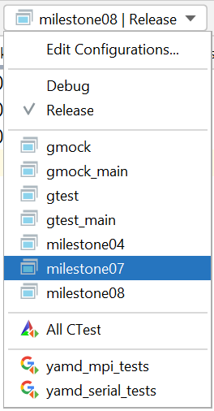
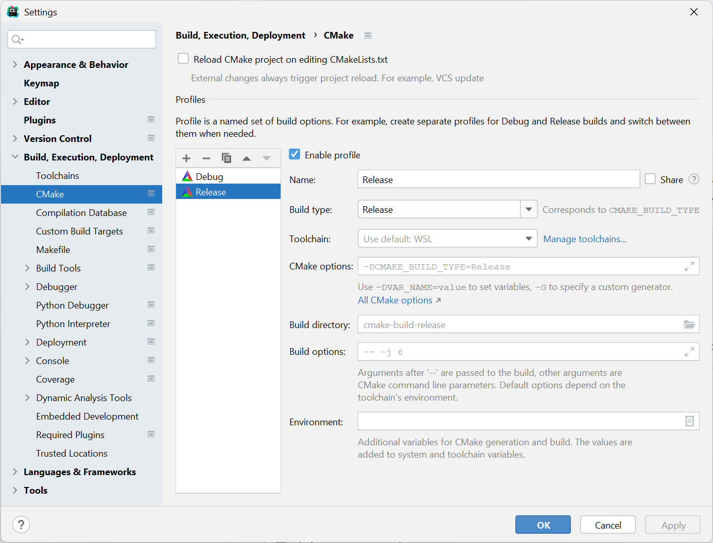

# CMake

## Adding subdirectories with separate executables

For organizing your milestone codes, it can be useful to have seperate `main.cpp` files in seperate subdirectories that correspond to each milestone. A possible directory structure could look like this:
```
milestones/
  CMakeLists.txt
  01/
    CMakeLists.txt
    main.cpp
  ...
  04/
    CMakeLists.txt
    main.cpp
    lj54.xyz
  ...
```
Each subdirectory contains a `CMakeLists.txt` that tells `CMake` what to do. You can tell `CMake` to add a subdirectory using the `add_subdirectory` command. The toplevel `CMakeLists.txt` requires an additional statement
```
add_subdirectory(milestones)
```
and `CMakeLists.txt` in the `milestones` subdirectory looks as follows:
```
add_subdirectory(01)
add_subdirectory(02)
add_subdirectory(03)
...
```
In each of the milestone directories we need to tell `CMake` to compile an executable and that `main.cpp` (in this directory) contains the `main` function. Additionally, it is useful to tell `CMake` about dependent files, e.g. the file `lj54.xyz` that is required to execute Milestone 04. The corresponding `CMakeLists.txt` looks like this:
```
configure_file(lj54.xyz .)
add_executable(milestone04 ${yamd_SRCS} ${yamd_HDRS} mail.cpp)
include_directories(milestone04 ${CMAKE_SOURCE_DIR})
target_link_libraries(milestone04 PUBLIC Eigen3::Eigen ${MPI_CXX_LIBRARIES})
```
The statement `add_executable` contains all source and headers files required to compile the code. The variables `yamd_SRCS` and `yamd_HDRS` are defined in the toplevel `CMakeLists.txt` and can be used here.

In `CLion`, these additional executables should show up as build targets:



## Debug vs. release builds

By default, `CLion` (and `CMake`) will configure debug builds. These builds are useful for development purposes, but their performance can be terrible. For running longer calculations it is useful to switch to a release build. This behavior is controlled by the `CMAKE_BUILD_TYPE` variable of the `CMake` build system. From the command line, it can be set by executing
```bash
cmake -DCMAKE_BUILD_TYPE=Release ..
```
In `CLion`, you can configure this in the menu option `File->Settings->Build, Execution, Deployment->CMake`. You should see the following dialog:



Simply pushing the little plus ("+") button will add a "Release" profile. Can can switch between "Debug" and "Release" in the build target selector shown above.