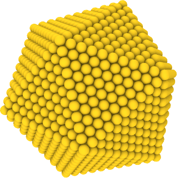

## Milestone 7   Embedded-atom method potential

### Learning goals

The student will...
* ...learn how to work with embedded atom method potentials.
* ...learn how to compute simple thermodynamic properties.

### Introduction

Embedded-atom method (EAM) potentials are good models for metallic systems. These potentials strive to be transferable, i.e. they can describe a number of different scenarios from the crystalline structure of unary metals or alloy, to amorphous alloys (metallic glasses) and melts. In this milestone, you will start working with a simple embedded atom potential and model the properties of a gold cluster. A cluster is an assembly of a finite number of atoms that is studied in [physics](https://en.wikipedia.org/wiki/Cluster_(physics)) and [chemistry](https://en.wikipedia.org/wiki/Atom_cluster). Cluster are used in applications ranging from catalysis to drug delivery. You will here compute the heat capacity and the latent heat of a gold cluster modeled with the embedded atom method.

### EAM potential

We provide an implementation of an EAM potential here: [gupta.h](gupta.h) [gupta.cpp](gupta.cpp) [test_gupta.cpp](test_gupta.cpp) Incorporate this potential into your code and your tests. You are of course also welcome to implement an EAM potential yourself. If you do, please point this out to us in your final report.

The specific code provided by us is an implementation of the method developed by [Gupta](https://doi.org/10.1103/PhysRevB.23.6265) and [Cleri & Rosato](https://doi.org/10.1103/PhysRevB.48.22). The default parameters are Cleri & Rosato's parameterization for gold. EAM variants typically differ by the functional forms employed for density, embedding energy and repulsion and can be easily adopted by modifying this code. Look at the code we provide for you and try to understand it and its test.

### Gold clusters

A gold cluster consists of just gold atoms and is characterized by its total number of atoms. Cluster whose size corresponds to a [magic number](https://en.wikipedia.org/wiki/Magic_number_(chemistry)) are highly stable. Magic numbers can correspond to the filling of an electron shell or to specific geometric structures.

A special structure is the [Mackay icosahedron](http://doye.chem.ox.ac.uk/jon/structures/Morse/paper/node6.html) (an example is shown above), that forms a cluster whose surfaces do not contain defects and are perfect atomic planes with (111) crystal orientation. We have created two Mackay icosahedra for you, one with [923 atoms](cluster_923.xyz) and another one with [3871 atoms](cluster_3871.xyz) using the [Maykay Icosahedron Structure Generator of Yanting Wang](http://www.pas.rochester.edu/~wangyt/algorithms/ih/). Download these coordinate files and inspect them with Ovito. Use these structures as starting point for your investigation.

### Units and time step

The previous milestones considered Lennard-Jones potentials and we did not dicuss units explicitly. Implicity, you have run all your calculations in Lennard-Jones units, where for example the energy scale is set by the parameter \\(\varepsilon\\). For the EAM potential, the energy and force units are specified by the parameter set. In the case of Cleri & Rosato, those units are A for lengths and eV for energies. Determine the resulting unit for time. Run a series of calculations to determine the time step. We suggest to use the Maykay icosahedra provided by us as starting points.

### Heat capacity and latent heat

The heat capacity \\(C\\) measure the relationship between temperature \\(T\\) and heat \\(\Delta Q\\) added to a system,

$$C = \lim_{\Delta T\to 0} \frac{\Delta Q}{\Delta T}$$

Since our cluster is fully isolated, adding energy will increase the total energy (potential and kinetic) of the cluster by the amount added. We can therefore write

$$C = \frac{d E}{d T}$$

where \\(E\\) is the total energy. Note that in a thermodynamic context this is typically either measured at constant volume or at constant pressure, but since we are here dealing with an isolated object (the cluster) those concepts do not straightforwardly apply here.

There are two strategies to measure the change of total energy with temperature and obtain a \\(E(T)\\) curve. You can either run constant temperature calculations and slowly ramp up the temperature, or you can run constant energy calculations slowly ramp up the energy. The latter is typically preferred since the total energy \\( E \\) is a constant of the dynamics. This means you can exactly control the energy while you can only control the mean temperature. We recommend to run NVE calculations and increase the energy stepwise, using the following rough protocol:
* Deposit a defined amount of heat \\( \Delta Q \\) in your system, e.g. by rescaling the temperature
* Let the system relax for a time period \\( \tau_\text{relax}\\)
* Sample (compute the average) temperature over a time period \\( \tau_\text{relax}\\)
* Repeat these steps as often as necessary

Make sure you increase the temperature beyond the melting point of the cluster. The plot \\(E(T)\\) shows you the heat capacity but also something else near the melting temperature. Describe what you see and why. Repeat the numerical experiment for different cluster sizes and plot melting point, heat capacity and latent heat as a function of cluster size.

### Task summary

This milestone requires the following tasks:

* Incorporate the Gupta EAM potential into your code
* Measure the heat capacity and latent heat of gold clusters as function of their size

Optional:

* Implement your own embedded-atom method potential

We ask you to provide the following results in your final report:

* Discussion of units and specification of the time unit
* Determination of the time step for the gold potential

We ask you to provide and discuss the following figures in your final report:

* Plot of the potential energy versus temperature
* Plot of the melting point versus cluster size
* Plot of the heat capacity versus cluster size
* Plot of the latent heat versus cluster size

We provide the following files for you:

* [gupta.h](gupta.h)
* [gupta.cpp](gupta.cpp)
* [test_gupta.cpp](test_gupta.cpp)

